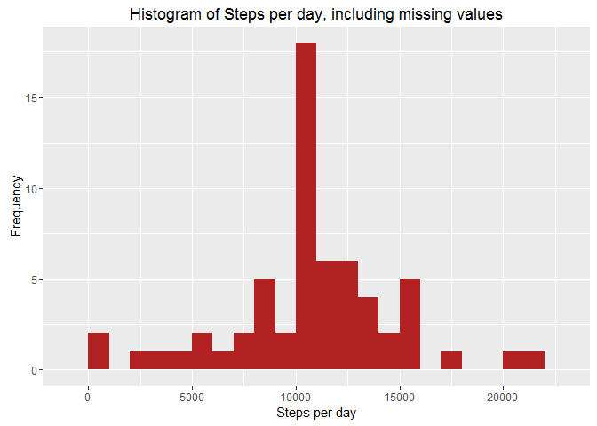
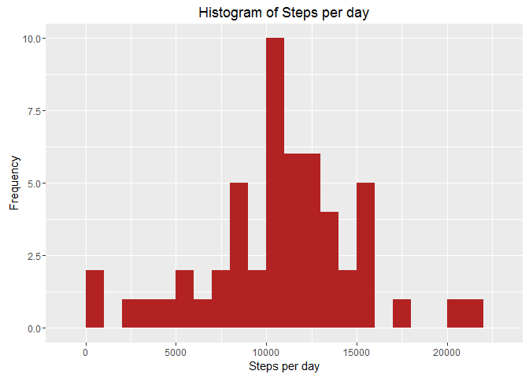

Introduction
============

This assignment makes use of data from a personal activity monitoring
device. This device collects data at 5 minute intervals throughout the
day. The data consists of two months of data from an anonymous
individual collected during the months of October and November, 2012 and
include the number of steps taken in 5 minute intervals each day.

This document presents the results from Project Assignment 1 in the
Coursera course Reproducible Research, written in a single R markdown
document that can be processed by knitr and transformed into an HTML
file.

R preparations
==============

In this document code will be represented to show how the results have
been achieved. Set the default of echo to be true throughout the
document:

    library(knitr)
    opts_chunk$set(echo = TRUE)

Load in the necessary packages
==============================

    library(dplyr)

    ## 
    ## Attaching package: 'dplyr'
    ## 
    ## The following objects are masked from 'package:stats':
    ## 
    ##     filter, lag
    ## 
    ## The following objects are masked from 'package:base':
    ## 
    ##     intersect, setdiff, setequal, union

    library(ggplot2)

Loading and preprocessing the data
==================================

Show any code that is needed to:

-   Load the data (i.e. 'read.csv()')
-   Process/transform the data (if necessary) into a format suitable for
    your analysis

Reading in the data
===================

The data is loaded using the 'read.csv()'.

NOTE: It is assumed that you have already downloaded t--- title:
"Project Assignment 1 - Reproducible Research" author: "Prabhu" date:
"January 9, 2016" output: pdf\_document ---

Introduction
============

This assignment makes use of data from a personal activity monitoring
device. This device collects data at 5 minute intervals throughout the
day. The data consists of two months of data from an anonymous
individual collected during the months of October and November, 2012 and
include the number of steps taken in 5 minute intervals each day.

This document presents the results from Project Assignment 1 in the
Coursera course Reproducible Research, written in a single R markdown
document that can be processed by knitr and transformed into an HTML
file.

R preparations
==============

In this document code will be represented to show how the results have
been achieved. Set the default of echo to be true throughout the
document:

    library(knitr)
    opts_chunk$set(echo = TRUE)

Load in the necessary packages
==============================

    library(dplyr)
    library(ggplot2)

Loading and preprocessing the data
==================================

Show any code that is needed to:

-   Load the data (i.e. 'read.csv()')
-   Process/transform the data (if necessary) into a format suitable for
    your analysis

Reading in the data
===================

The data is loaded using the 'read.csv()'.

NOTE: It is assumed that you have already downloaded the activity.csv
and saved it in your working directory. If not, please download the code
here, unzip it and save it to your working directory.

    data <- read.csv("activity.csv", header = TRUE, sep = ',', 
                     colClasses = c("numeric", "character","integer"))

Tidying the data
================

Check the data with str() and head():

    str(data)

    ## 'data.frame':    17568 obs. of  3 variables:
    ##  $ steps   : num  NA NA NA NA NA NA NA NA NA NA ...
    ##  $ date    : chr  "2012-10-01" "2012-10-01" "2012-10-01" "2012-10-01" ...
    ##  $ interval: int  0 5 10 15 20 25 30 35 40 45 ...

    head(data)

    ##   steps       date interval
    ## 1    NA 2012-10-01        0
    ## 2    NA 2012-10-01        5
    ## 3    NA 2012-10-01       10
    ## 4    NA 2012-10-01       15
    ## 5    NA 2012-10-01       20
    ## 6    NA 2012-10-01       25

Now everything is ready and set up for solving some problems.

What is mean total number of steps taken per day?
=================================================

For this part of the assignment the missing values can be ignored.

-   Calculate the total number of steps taken per day.
-   Make a histogram of the total number of steps taken each day.
-   Calculate and report the mean and median of the total number of
    steps taken per day.

-   Methodology and Result \*

Calculate the total number of steps per day using dplyr and group by
date:

    steps <- data %>%
      filter(!is.na(steps)) %>%
      group_by(date) %>%
      summarize(steps = sum(steps)) %>%
      print

    ## Source: local data frame [53 x 2]
    ## 
    ##          date steps
    ##         (chr) (dbl)
    ## 1  2012-10-02   126
    ## 2  2012-10-03 11352
    ## 3  2012-10-04 12116
    ## 4  2012-10-05 13294
    ## 5  2012-10-06 15420
    ## 6  2012-10-07 11015
    ## 7  2012-10-09 12811
    ## 8  2012-10-10  9900
    ## 9  2012-10-11 10304
    ## 10 2012-10-12 17382
    ## ..        ...   ...

-   Use ggplot for making the histogram

<!-- -->

    ggplot(steps, aes(x = steps)) +
      geom_histogram(fill = "firebrick", binwidth = 1000) +
      labs(title = "Histogram of Steps per day", x = "Steps per day", y = "Frequency")

 \*
Calculate the mean and median of the total number of steps taken per
day:

    mean_steps <- mean(steps$steps, na.rm = TRUE)
    median_steps <- median(steps$steps, na.rm = TRUE)

Mean steps are 10766 and median steps are 10765.

What is the average daily activity pattern?
===========================================

-   Make a time series plot (i.e. type = "l") of the 5-minute interval
    (x-axis) and the average number of steps taken, averaged across all
    days (y-axis).
-   Which 5-minute interval, on average across all the days in the
    dataset, contains the maximum number of steps?.

Methodology and Result

-   Calculate the average number of steps taken in each 5-minute
    interval per day using dplyr and group by interval

<!-- -->

    interval <- data %>%
      filter(!is.na(steps)) %>%
      group_by(interval) %>%
      summarize(steps = mean(steps))

Use ggplot for making the time series of the 5-minute interval and
average steps taken:

    ggplot(interval, aes(x=interval, y=steps)) +
      geom_line(color = "firebrick")

-   Use which.max() to find out the maximum steps, on average, across
    all the days:

<!-- -->

    interval[which.max(interval$steps),]

    ## Source: local data frame [1 x 2]
    ## 
    ##   interval    steps
    ##      (int)    (dbl)
    ## 1      835 206.1698

Imputing missing values
=======================

Note that there are a number of days/intervals where there are missing
values (coded as NA). The presence of missing days may introduce bias
into some calculations or summaries of the data.

-   Calculate and report the total number of missing values in the
    dataset (i.e. the total number of rows with NAs).
-   Devise a strategy for filling in all of the missing values in the
    dataset. The strategy does not need to be sophisticated. For
    example, you could use the mean/median for that day, or the mean for
    that 5-minute interval, etc.
-   Create a new dataset that is equal to the original dataset but with
    the missing data filled in.
-   Make a histogram of the total number of steps taken each day and
    calculate and report the mean and median total number of steps taken
    per day. Do these values differ from the estimates from the first
    part of the assignment? What is the impact of imputing missing data
    on the estimates of the total daily number of steps?

Methodology and Result \* Summarize all the missing values:

    sum(is.na(data$steps))

    ## [1] 2304

Missing values are 2304.

-   Let’s take the approach to fill in a missing NA with the average
    number of steps in the same 5-min interval.

-   Create a new dataset as the original and use tapply for filling in
    the missing values with the average number of steps per 5-minute
    interval:

<!-- -->

    data_full <- data
    nas <- is.na(data_full$steps)
    avg_interval <- tapply(data_full$steps, data_full$interval, mean, na.rm=TRUE, simplify=TRUE)
    data_full$steps[nas] <- avg_interval[as.character(data_full$interval[nas])]

Check that there are no missing values:

    sum(is.na(data_full$steps))

    ## [1] 0

No more missing values.

-   Calculate the number of steps taken in each 5-minute interval per
    day using dplyr and group by interval. Use ggplot for making the
    histogram:

<!-- -->

    steps_full <- data_full %>%
      filter(!is.na(steps)) %>%
      group_by(date) %>%
      summarize(steps = sum(steps)) %>%
      print

    ## Source: local data frame [61 x 2]
    ## 
    ##          date    steps
    ##         (chr)    (dbl)
    ## 1  2012-10-01 10766.19
    ## 2  2012-10-02   126.00
    ## 3  2012-10-03 11352.00
    ## 4  2012-10-04 12116.00
    ## 5  2012-10-05 13294.00
    ## 6  2012-10-06 15420.00
    ## 7  2012-10-07 11015.00
    ## 8  2012-10-08 10766.19
    ## 9  2012-10-09 12811.00
    ## 10 2012-10-10  9900.00
    ## ..        ...      ...

Histogram of Steps per day, including missing values plot.

    ggplot(steps_full, aes(x = steps)) +
      geom_histogram(fill = "firebrick", binwidth = 1000) +
      labs(title = "Histogram of Steps per day, including missing values", x = "Steps per day", y = "Frequency")

Calculate the mean and median steps with the filled in values:

    mean_steps_full <- mean(steps_full$steps, na.rm = TRUE)
    median_steps_full <- median(steps_full$steps, na.rm = TRUE)

    mean_steps_full

    ## [1] 10766.19

    median_steps_full

    ## [1] 10766.19

The impact of imputing missing data with the average number of steps in
the same 5-min interval is that both the mean and the median are equal
to the same value: 10766.

Are there differences in activity patterns between weekdays and weekends?
=========================================================================

For this part the weekdays() will come handy. Use the dataset with the
filled-in missing values for this part.

-   Create a new factor variable in the dataset with two levels -
    “weekday” and “weekend” indicating whether a given date is a weekday
    or weekend day.
-   Make a panel plot containing a time series plot (i.e. type = "l") of
    the 5-minute interval (x-axis) and the average number of steps
    taken, averaged across all weekday days or weekend days (y-axis).

-   Methodology and Result

<!-- -->

    str(data)

    ## 'data.frame':    17568 obs. of  3 variables:
    ##  $ steps   : num  NA NA NA NA NA NA NA NA NA NA ...
    ##  $ date    : chr  "2012-10-01" "2012-10-01" "2012-10-01" "2012-10-01" ...
    ##  $ interval: int  0 5 10 15 20 25 30 35 40 45 ...

    head(data)

    ##   steps       date interval
    ## 1    NA 2012-10-01        0
    ## 2    NA 2012-10-01        5
    ## 3    NA 2012-10-01       10
    ## 4    NA 2012-10-01       15
    ## 5    NA 2012-10-01       20
    ## 6    NA 2012-10-01       25

Completed
=========

he activity.csv and saved it in your working directory. If not, please
download the code here, unzip it and save it to your working directory.

    data <- read.csv("activity.csv", header = TRUE, sep = ',', 
                     colClasses = c("numeric", "character","integer"))

Tidying the data
================

Check the data with str() and head():

    str(data)

    ## 'data.frame':    17568 obs. of  3 variables:
    ##  $ steps   : num  NA NA NA NA NA NA NA NA NA NA ...
    ##  $ date    : chr  "2012-10-01" "2012-10-01" "2012-10-01" "2012-10-01" ...
    ##  $ interval: int  0 5 10 15 20 25 30 35 40 45 ...

    head(data)

    ##   steps       date interval
    ## 1    NA 2012-10-01        0
    ## 2    NA 2012-10-01        5
    ## 3    NA 2012-10-01       10
    ## 4    NA 2012-10-01       15
    ## 5    NA 2012-10-01       20
    ## 6    NA 2012-10-01       25

Now everything is ready and set up for solving some problems.

What is mean total number of steps taken per day?
=================================================

For this part of the assignment the missing values can be ignored.

-   Calculate the total number of steps taken per day.
-   Make a histogram of the total number of steps taken each day.
-   Calculate and report the mean and median of the total number of
    steps taken per day.

-   Methodology and Result \*

Calculate the total number of steps per day using dplyr and group by
date:

    steps <- data %>%
      filter(!is.na(steps)) %>%
      group_by(date) %>%
      summarize(steps = sum(steps)) %>%
      print

    ## Source: local data frame [53 x 2]
    ## 
    ##          date steps
    ##         (chr) (dbl)
    ## 1  2012-10-02   126
    ## 2  2012-10-03 11352
    ## 3  2012-10-04 12116
    ## 4  2012-10-05 13294
    ## 5  2012-10-06 15420
    ## 6  2012-10-07 11015
    ## 7  2012-10-09 12811
    ## 8  2012-10-10  9900
    ## 9  2012-10-11 10304
    ## 10 2012-10-12 17382
    ## ..        ...   ...

-   Use ggplot for making the histogram

<!-- -->

    ggplot(steps, aes(x = steps)) +
      geom_histogram(fill = "firebrick", binwidth = 1000) +
      labs(title = "Histogram of Steps per day", x = "Steps per day", y = "Frequency")

 \*
Calculate the mean and median of the total number of steps taken per
day:

    mean_steps <- mean(steps$steps, na.rm = TRUE)
    median_steps <- median(steps$steps, na.rm = TRUE)

Mean steps are 10766 and median steps are 10765.

What is the average daily activity pattern?
===========================================

-   Make a time series plot (i.e. type = "l") of the 5-minute interval
    (x-axis) and the average number of steps taken, averaged across all
    days (y-axis).
-   Which 5-minute interval, on average across all the days in the
    dataset, contains the maximum number of steps?.

Methodology and Result

-   Calculate the average number of steps taken in each 5-minute
    interval per day using dplyr and group by interval

<!-- -->

    interval <- data %>%
      filter(!is.na(steps)) %>%
      group_by(interval) %>%
      summarize(steps = mean(steps))

Use ggplot for making the time series of the 5-minute interval and
average steps taken:

    ggplot(interval, aes(x=interval, y=steps)) +
      geom_line(color = "firebrick")

-   Use which.max() to find out the maximum steps, on average, across
    all the days:

<!-- -->

    interval[which.max(interval$steps),]

    ## Source: local data frame [1 x 2]
    ## 
    ##   interval    steps
    ##      (int)    (dbl)
    ## 1      835 206.1698

Imputing missing values
=======================

Note that there are a number of days/intervals where there are missing
values (coded as NA). The presence of missing days may introduce bias
into some calculations or summaries of the data.

-   Calculate and report the total number of missing values in the
    dataset (i.e. the total number of rows with NAs).
-   Devise a strategy for filling in all of the missing values in the
    dataset. The strategy does not need to be sophisticated. For
    example, you could use the mean/median for that day, or the mean for
    that 5-minute interval, etc.
-   Create a new dataset that is equal to the original dataset but with
    the missing data filled in.
-   Make a histogram of the total number of steps taken each day and
    calculate and report the mean and median total number of steps taken
    per day. Do these values differ from the estimates from the first
    part of the assignment? What is the impact of imputing missing data
    on the estimates of the total daily number of steps?

Methodology and Result \* Summarize all the missing values:

    sum(is.na(data$steps))

    ## [1] 2304

Missing values are 2304.

-   Let’s take the approach to fill in a missing NA with the average
    number of steps in the same 5-min interval.

-   Create a new dataset as the original and use tapply for filling in
    the missing values with the average number of steps per 5-minute
    interval:

<!-- -->

    data_full <- data
    nas <- is.na(data_full$steps)
    avg_interval <- tapply(data_full$steps, data_full$interval, mean, na.rm=TRUE, simplify=TRUE)
    data_full$steps[nas] <- avg_interval[as.character(data_full$interval[nas])]

Check that there are no missing values:

    sum(is.na(data_full$steps))

    ## [1] 0

No more missing values.

-   Calculate the number of steps taken in each 5-minute interval per
    day using dplyr and group by interval. Use ggplot for making the
    histogram:

<!-- -->

    steps_full <- data_full %>%
      filter(!is.na(steps)) %>%
      group_by(date) %>%
      summarize(steps = sum(steps)) %>%
      print

    ## Source: local data frame [61 x 2]
    ## 
    ##          date    steps
    ##         (chr)    (dbl)
    ## 1  2012-10-01 10766.19
    ## 2  2012-10-02   126.00
    ## 3  2012-10-03 11352.00
    ## 4  2012-10-04 12116.00
    ## 5  2012-10-05 13294.00
    ## 6  2012-10-06 15420.00
    ## 7  2012-10-07 11015.00
    ## 8  2012-10-08 10766.19
    ## 9  2012-10-09 12811.00
    ## 10 2012-10-10  9900.00
    ## ..        ...      ...

Histogram of Steps per day, including missing values plot.

    ggplot(steps_full, aes(x = steps)) +
      geom_histogram(fill = "firebrick", binwidth = 1000) +
      labs(title = "Histogram of Steps per day, including missing values", x = "Steps per day", y = "Frequency")

Calculate the mean and median steps with the filled in values:

    mean_steps_full <- mean(steps_full$steps, na.rm = TRUE)
    median_steps_full <- median(steps_full$steps, na.rm = TRUE)

    mean_steps_full

    ## [1] 10766.19

    median_steps_full

    ## [1] 10766.19

The impact of imputing missing data with the average number of steps in
the same 5-min interval is that both the mean and the median are equal
to the same value: 10766.

Are there differences in activity patterns between weekdays and weekends?
=========================================================================

For this part the weekdays() will come handy. Use the dataset with the
filled-in missing values for this part.

-   Create a new factor variable in the dataset with two levels -
    “weekday” and “weekend” indicating whether a given date is a weekday
    or weekend day.
-   Make a panel plot containing a time series plot (i.e. type = "l") of
    the 5-minute interval (x-axis) and the average number of steps
    taken, averaged across all weekday days or weekend days (y-axis).

-   Methodology and Result

<!-- -->

    str(data)

    ## 'data.frame':    17568 obs. of  3 variables:
    ##  $ steps   : num  NA NA NA NA NA NA NA NA NA NA ...
    ##  $ date    : chr  "2012-10-01" "2012-10-01" "2012-10-01" "2012-10-01" ...
    ##  $ interval: int  0 5 10 15 20 25 30 35 40 45 ...

    head(data)

    ##   steps       date interval
    ## 1    NA 2012-10-01        0
    ## 2    NA 2012-10-01        5
    ## 3    NA 2012-10-01       10
    ## 4    NA 2012-10-01       15
    ## 5    NA 2012-10-01       20
    ## 6    NA 2012-10-01       25

Completed
=========
